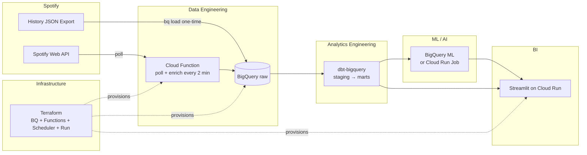

# Spotify Listening Analytics — Project Plan

> A cloud-native data platform that ingests your Spotify listening history in near-real-time,
> transforms it with dbt + BigQuery, runs ML models for recommendations and forecasting, and
> serves it all through a Streamlit dashboard — covering **Data Engineering**, **Analytics
> Engineering**, **ML/AI**, and **BI** on GCP free tier.

**Author:** mathsisbest · **Status:** Plan · **Cost target:** GCP free tier ($0)

---

## 1. Why this project

Same pitch as macro-scope — one system where data flows end-to-end and every layer is done
properly — but on a **cloud-native stack** (BigQuery, Cloud Functions, Cloud Run, Terraform)
instead of local DuckDB. The domain is personal and relatable:

> *"Your Spotify listening history is streamed in every few minutes, modelled into analytical
> tables, scored by ML models, and presented in a live dashboard — all on GCP free tier,
> infrastructure-as-coded, CI-gated, and reproducible."*

Each layer maps to a part of the modern cloud data stack:

| Layer | Where it lives | What it shows |
|---|---|---|
| **Data Engineering** | Cloud Functions + BigQuery + Cloud Scheduler | Streaming ingestion with OAuth, serverless compute, idempotent loads |
| **Analytics Engineering** | dbt-bigquery: staging → intermediate → marts, tests, docs, lineage | Cloud warehouse transformations |
| **ML / AI** | BigQuery ML + scikit-learn on Cloud Run Jobs | Audio-feature clustering, skip/like prediction, listening forecast |
| **BI** | Streamlit on Cloud Run: Plotly charts, KPIs, "your year in review" | Cloud-deployed dashboard with live data |
| **Infrastructure** | Terraform + Cloud Build | IaC — whole platform deployable with one command |

---

## 2. Data sources

| Source | Data | Auth | Cadence | Free limit |
|---|---|---|---|---|
| **Spotify Recently Played API** | Track, artist, album, timestamp, context | OAuth (user-read-recently-played) | Every 2 min (poll) | No hard cap for personal use |
| **Spotify Audio Features API** | Danceability, energy, valence, tempo, loudness, etc. | OAuth | On new-track discovery | No hard cap |
| **Spotify Track/Artist API** | Genre, popularity, duration | OAuth | As needed | No hard cap |
| **Extended streaming history** (one-time) | Full history JSON export | Spotify account privacy page | Once (takes ~30 days to arrive) | N/A |

> **The "streaming" story:** the Recently Played endpoint returns the last 50 tracks. Polling
> every 2 minutes captures virtually everything. Combined with a one-time history load, you get
> years of past data + sub-5-minute freshness going forward. No Kafka needed — this is the
> **serverless polling pattern** that most real-world streaming pipelines actually use.

---

## 3. Architecture



---

## 4. Tech stack

| Concern | Choice | Why / free-tier note |
|---|---|---|
| Language | **Python 3.11+** | One language across all layers |
| Cloud | **GCP** (free tier) | $300 credits + BigQuery 10 GB free + Cloud Functions 2M/mo + Cloud Run 2M/mo |
| Warehouse | **BigQuery** | Serverless, $0 for <1 TB queried/mo, native dbt adapter |
| Ingestion | **Cloud Functions (gen2)** + **Cloud Scheduler** | Serverless, cron-triggered, sub-5-min latency |
| Transform | **dbt-core + dbt-bigquery** | Same dbt, cloud target; lineage, tests, docs |
| ML | **BigQuery ML** (simple models) + **scikit-learn** (advanced) | BQML for quick wins; Cloud Run Jobs for custom models |
| Dashboard | **Streamlit** on **Cloud Run** | Code-defined UI; containerised, autoscaling to 0 |
| Charts | **Plotly** | Interactive, thematic, code-driven |
| Auth | **Spotify OAuth** with refresh-token rotation | Non-interactive server-side auth — a real engineering detail |
| Infra | **Terraform** + **Cloud Build** | Full IaC — `terraform apply` provisions everything |
| CI | **GitHub Actions** (lint + test + dbt build on PR) | 2,000 free minutes/mo |
| Quality | **ruff, pytest, mypy, pre-commit** | Same standards as macro-scope |

---

## 5. Repository structure

```
spotify-analytics/
├── README.md
├── PLAN.md
├── pyproject.toml
├── Makefile
├── .env.example
├── .pre-commit-config.yaml
├── .gitignore
│
├── .github/workflows/
│   ├── ci.yml                  # ruff + mypy + pytest + dbt build on PR
│   └── deploy.yml              # terraform plan/apply on push to main
│
├── terraform/
│   ├── main.tf                 # GCP provider, project, APIs
│   ├── bigquery.tf             # datasets + tables
│   ├── functions.tf            # Cloud Function ingestion
│   ├── scheduler.tf            # cron trigger
│   ├── cloudrun.tf             # Streamlit dashboard service
│   └── variables.tf
│
├── src/spotify_analytics/
│   ├── __init__.py
│   ├── auth.py                 # Spotify OAuth flow + token refresh
│   ├── client.py               # Spotify API wrapper (recently played, audio features)
│   ├── ingest.py               # Cloud Function entrypoint: poll → validate → load
│   ├── load.py                 # BigQuery upsert logic
│   ├── models.py               # Pydantic models for payloads
│   └── enrich.py               # audio-feature enrichment pipeline
│
├── transform/                  # ── dbt project ──
│   ├── dbt_project.yml
│   ├── profiles/               # profiles.yml per target (dev/ci/prod)
│   ├── models/
│   │   ├── staging/            # cleaned, typed views over raw
│   │   ├── intermediate/       # sessionization, rolling windows, artist enrichment
│   │   └── marts/              # listening_summary, artist_stats, genre_trends
│   ├── tests/
│   └── seeds/                  # genre lookup, country codes
│
├── ml/                         # ── ML training (runs as Cloud Run Job) ──
│   ├── features.py             # feature engineering from marts
│   ├── train.py                # train/cluster models, upload to BQ
│   ├── recommend.py            # next-track recommender
│   └── forecast.py             # listening-volume forecast
│
├── dashboard/                  # ── BI (Streamlit) ──
│   ├── app.py                  # main entrypoint
│   ├── theme.py
│   ├── data.py                 # BigQuery reads with @st.cache
│   └── components/
│       ├── kpi.py
│       ├── charts.py
│       └── recommender.py
│
├── scripts/
│   └── bulk_load_history.py    # one-shot: load Spotify export JSON → BQ
│
├── tests/
│   ├── test_auth.py
│   ├── test_ingest.py
│   ├── test_features.py
│   └── test_dashboard.py
│
└── docs/
    └── adr/
```

---

## 6. Layer-by-layer design

### 6.1 Data Engineering

**Ingestion pattern:**
- Cloud Function (gen2, 128 MB, Python 3.11) runs every 2 minutes via Cloud Scheduler + Pub/Sub
- Calls `GET /v1/me/player/recently-played` with OAuth Bearer token
- Validates with Pydantic models, deduplicates on `(track_id, played_at)`, inserts to `raw.streaming_history`
- Also calls Audio Features API for any tracks missing features in `raw.track_features`
- Writes audit row to `raw.ingestion_runs` (rows ingested, duration, status)

**OAuth detail (the interesting bit):**
- Spotify uses short-lived (1h) access tokens + long-lived refresh tokens
- First auth is manual: user visits a URL, authorises, callback captures the refresh token
- Thereafter, the Cloud Function checks token expiry and refreshes automatically
- Refresh token is stored as a GCP Secret Manager secret (free tier: 6 secrets)

**One-time history load:**
- User requests their extended streaming history from Spotify privacy settings
- When it arrives (~30 days), run `scripts/bulk_load_history.py` which `bq load`s the JSON
- History JSON has different schema (no `context`, but includes `ms_played`, `end_time`)

### 6.2 Analytics Engineering (dbt-bigquery)

Three medallion layers, same pattern as macro-scope but targeting BigQuery:

- **`staging`**: clean types, deduplicate, cast timestamps — one model per raw table
- **`intermediate`**:
  - `int_listening_sessions` — sessionize (gap > 30 min = new session)
  - `int_artist_enrichment` — artist genres, popularity, follower counts
  - `int_rolling_features` — 7-day/30-day rolling avg of audio features per artist
  - `int_time_features` — time-of-day, day-of-week, holiday flags, month
- **`marts`**:
  - `fct_listening` — one row per listen (enriched with audio features + time features)
  - `dim_track` — track metadata + audio features (slowly changing)
  - `dim_artist` — artist metadata, genres (array)
  - `fct_daily_summary` — daily aggregate: minutes listened, track count, artist count, top genres
  - `fct_artist_concentration` — herfindahl index, top-1/top-5 share over time
  - `fct_genre_trends` — genre share over time, genre switching between sessions

### 6.3 ML / AI

Three ML tracks, each with explicit baselines:

**1. Track-skip / like prediction** (BQML or scikit-learn) — predict whether you'll replay a track
based on audio features, time-of-day, artist, session position. Baseline: most-frequent-class.

**2. Audio-feature clustering** (scikit-learn, HDBSCAN) — cluster tracks by audio feature vector;
find "moods" or "sonic signatures" that aren't labelled by genre. Dashboard shows cluster
evolution over time.

**3. Listening-volume forecasting** (Prophet or BQML ARIMA) — predict minutes listened per day
for the next 14 days; flag anomaly days (way above/below expected). Baseline: 7-day rolling
average.

**Training pipeline:** runs weekly as a Cloud Run Job, reads from marts, writes results back to
`marts.model_metrics` and `marts.track_clusters`. Metrics tracked: MAE, F1, silhouette score.

### 6.4 BI (Streamlit on Cloud Run)

Dashboard sections:

1. **Now / recent** — live badge showing the last 20 tracks, "listening right now" indicator
2. **Your Year in Review** — total minutes, top artists/tracks/genres, listening heatmap,
   day-vs-night split, genre diversity trend
3. **Genre Explorer** — genre share over time (area chart), genre transition sankey
4. **Mood Map** — scatter plot of tracks on energy×valence axes, coloured by cluster,
   click to play preview
5. **Forecast** — next-14-day listening prediction with confidence intervals
6. **Recommendations** — "tracks you haven't heard in a while that match your current mood"
7. **Raw Truth** — searchable table of every listen

Deployed via Docker → Artifact Registry → Cloud Run. Streamlit's `st.connection` for
native BigQuery integration. Cloud Run's managed SSL + custom domain.

---

## 7. Infrastructure as Code (Terraform)

```hcl
# terraform/main.tf — provisions:
# - GCP project + enabled APIs (bigquery, cloudfunctions, cloudscheduler, run, secretmanager)
# - BigQuery datasets: raw, staging, marts (with default table expiration)
# - Cloud Function (gen2) with Pub/Sub trigger
# - Cloud Scheduler job (every 2 min → Pub/Sub → Function)
# - Cloud Run service (Streamlit dashboard, public with IAM)
# - Secret Manager secret (Spotify refresh token)
# - Service account with minimal permissions (BQ insert, Secret access)
```

Single command: `terraform apply` creates the entire platform.

---

## 8. CI / CD

| Trigger | Workflow | What it does |
|---|---|---|
| PR to main | `ci.yml` | ruff, mypy, pytest, `dbt build --target ci` against ephemeral BQ dataset |
| Push to main | `deploy.yml` | `terraform apply` + `gcloud builds submit` for dashboard container |
| Schedule | Cloud Scheduler | Polls Spotify every 2 min, triggers Cloud Function |

CI uses a dedicated GCP service account with a separate `dev` BQ dataset set to 7-day
table expiration — CI dbt runs cost ~$0 (well under 1 TB/month).

---

## 9. Cost breakdown

| Item | Service | Cost |
|---|---|---|
| Ingestion compute | Cloud Functions (2M invocations/mo) | $0 |
| Warehouse | BigQuery (10 GB storage, <1 TB queried) | $0 |
| Dashboard hosting | Cloud Run (2M requests/mo, always-free tier) | $0 |
| Orchestration | Cloud Scheduler (3 jobs free) | $0 |
| Secrets | Secret Manager (6 free secrets) | $0 |
| CI | GitHub Actions (2,000 min/mo) | $0 |
| Container registry | Artifact Registry (0.5 GB free) | $0 |
| Spotify API | Personal-use rate limits | $0 |
| **Total** | | **$0 / month** |

---

## 10. Phased roadmap

| Phase | Goal | Deliverable |
|---|---|---|
| **0 — Scaffold** | Repo skeleton, Terraform, empty dbt project, Streamlit shell, CI | `terraform apply` creates working infra, `make ci` passes |
| **1 — Data Engineering** | OAuth flow, Cloud Function ingestion, bulk history load | Raw tables filling every 2 min |
| **2 — Analytics Engineering** | Full dbt staging→marts + tests + docs | `dbt build` green on BQ |
| **3 — ML / AI** | Clustering, skip prediction, listening forecast | Model metrics in marts, predictions in dashboard |
| **4 — BI** | All dashboard sections live, deployed on Cloud Run | Public URL with live data |
| **5 — Polish** | README with screenshots, ADRs, coverage badge, custom domain | Portfolio-ready |

---

## 11. Key differences from macro-scope

| | macro-scope | spotify-analytics |
|---|---|---|
| Warehouse | DuckDB (embedded) | **BigQuery** (cloud) |
| Infrastructure | Manually set up | **Terraform** (IaC) |
| Ingestion | Python scripts in repo | **Cloud Functions** (serverless) |
| Dashboard deploy | Streamlit Community Cloud | **Cloud Run** (Docker, auto-scaling) |
| Auth | Free API keys | **OAuth with token refresh** |
| ML target | Time-series forecasting | **Clustering + classification + forecasting** |
| Data cadence | Daily (macro data) | **Every 2 minutes** (near-real-time) |

---

## 12. What to do next

1. Create a GCP free-tier account and project
2. Request your Spotify extended streaming history (do this *today*)
3. Set up a Spotify Developer app to get client ID + secret
4. Run the OAuth flow once to get a refresh token
5. `terraform apply` to provision everything
6. Work the roadmap phase by phase
