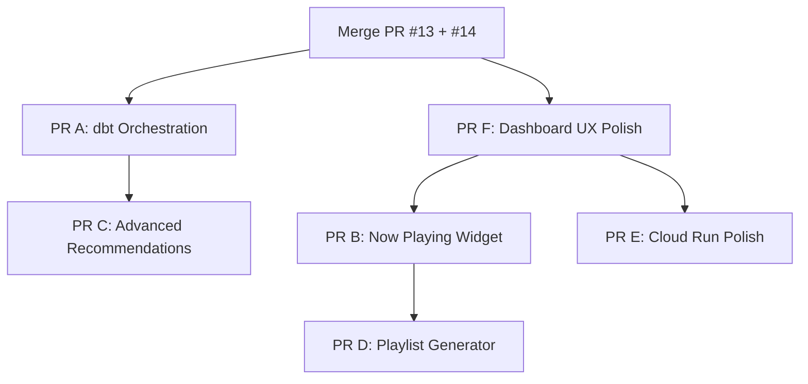

# Resonance — Complete Roadmap & Implementation Guide

> **For**: DeepSeek to implement as individual PRs on feature branches  
> **Repo**: `mathsisbest/spotify-analytics` (GitHub)  
> **Main branch gate**: `make ci` → ruff check ✅, mypy strict ✅, pytest 241/241 ✅ (99% coverage)  
> **Convention**: Every PR must pass `make ci` before requesting review

---

## 📊 Current State (as of 2026-07-27)

### What's Done
| Area | Status | Details |
|------|--------|---------|
| Spotify OAuth | ✅ Done | Loopback auth flow in `scripts/get_refresh_token.py`, refresh token in GCP Secret Manager |
| GCP Infra (Terraform) | ✅ Done | BigQuery (raw/staging/marts), Cloud Function, Cloud Scheduler (2-min poll), Cloud Run, ML Job |
| Data Ingestion | ✅ Done | `src/spotify_analytics/` — auth, client, ingest, enrich, load, models |
| dbt Models | ✅ Done | 2 staging, 4 intermediate, 9 marts models in `transform/` |
| ML Pipeline | ✅ Done | Cluster (DBSCAN), Predict (RandomForest), Forecast (Holt-Winters), Recommend (k-NN) in `ml/` |
| Streamlit Dashboard | ✅ Done | 7 pages with glassmorphism design, real BigQuery data |
| Tests | ✅ Done | 241 tests, 99% coverage |
| CI (GitHub Actions) | ✅ Merged (PR #12) | ruff, mypy, pytest, dbt-test jobs |
| Deploy Workflow | ✅ Done | `.github/workflows/deploy.yml` — Terraform + Cloud Run on push to main |

### Open PRs (Pending Review)
| PR | Branch | Description |
|----|--------|-------------|
| [#13](https://github.com/mathsisbest/spotify-analytics/pull/13) | `feature/rebrand-resonance` | Rebrand from "Shylla Analytics" → "Resonance" |
| [#14](https://github.com/mathsisbest/spotify-analytics/pull/14) | `fix/import-sorting-and-ci-setup` | CI workflow simplification + import fix |

> [!IMPORTANT]
> **Merge PR #13 and #14 first** before starting any new work below. Resolve any merge conflicts between them since both touch `ci.yml`.

---

## 📋 Remaining Tasks — Ordered by Priority

### PR A: 🔄 Automated dbt Medallion Orchestration
### PR B: 🎵 Real-Time "Currently Playing" Dashboard Widget  
### PR C: 🤖 Advanced Vector Audio Recommendations & Mood Transitions
### PR D: 🎧 One-Click Spotify Playlist Generator
### PR E: 🌐 Cloud Run Production Hosting Polish
### PR F: 🏷️ Dashboard UX Enhancements & Missing Features

---

## PR A: 🔄 Automated dbt Medallion Orchestration

**Goal**: Auto-refresh marts models (daily aggregations, ML forecasts, cluster assignments) as raw data streams in from the Cloud Function.

**Why**: Currently dbt must be run manually. The marts layer (which the dashboard queries) goes stale unless someone SSH'es in and runs `dbt build`.

### Files to Create/Modify

#### 1. Create `terraform/dbt_job.tf`
Add a new Cloud Run Job + Cloud Scheduler to run dbt on a schedule.

```hcl
# Cloud Run Job that runs dbt build against BigQuery
resource "google_cloud_run_v2_job" "dbt_build" {
  name     = "resonance-dbt-build"
  location = var.region

  template {
    task_count = 1
    template {
      max_retries     = 1
      timeout         = "900s"
      service_account = google_service_account.dbt_runner.email

      containers {
        image = "${var.region}-docker.pkg.dev/${var.project_id}/${google_artifact_registry_repository.dbt_runner.repository_id}/dbt-runner:latest"

        env {
          name  = "GCP_PROJECT_ID"
          value = var.project_id
        }
        env {
          name  = "DBT_TARGET"
          value = "prod"
        }

        resources {
          limits = {
            cpu    = "1"
            memory = "512Mi"
          }
        }
      }
    }
  }
  depends_on = [google_project_service.services]
}

# Service account for dbt runner
resource "google_service_account" "dbt_runner" {
  account_id   = "resonance-dbt-runner"
  display_name = "Resonance dbt Build Runner"
}

# IAM: read raw + staging, write marts
resource "google_bigquery_dataset_iam_member" "dbt_read_raw" {
  dataset_id = google_bigquery_dataset.raw.dataset_id
  role       = "roles/bigquery.dataViewer"
  member     = "serviceAccount:${google_service_account.dbt_runner.email}"
}

resource "google_bigquery_dataset_iam_member" "dbt_write_marts" {
  dataset_id = google_bigquery_dataset.marts.dataset_id
  role       = "roles/bigquery.dataEditor"
  member     = "serviceAccount:${google_service_account.dbt_runner.email}"
}

resource "google_bigquery_dataset_iam_member" "dbt_write_staging" {
  dataset_id = google_bigquery_dataset.staging.dataset_id
  role       = "roles/bigquery.dataEditor"
  member     = "serviceAccount:${google_service_account.dbt_runner.email}"
}

# Artifact Registry repo for the dbt runner image
resource "google_artifact_registry_repository" "dbt_runner" {
  location      = var.region
  repository_id = "resonance-dbt-runner"
  format        = "DOCKER"
  description   = "Container images for the dbt build runner"
}

# Cloud Scheduler — run dbt build every 6 hours
resource "google_cloud_scheduler_job" "dbt_build_trigger" {
  name        = "resonance-dbt-build-trigger"
  description = "Triggers dbt build Cloud Run Job every 6 hours"
  schedule    = "0 */6 * * *"
  time_zone   = "Etc/UTC"

  retry_config {
    retry_count = 1
  }

  http_target {
    http_method = "POST"
    uri         = "https://${var.region}-run.googleapis.com/apis/run.googleapis.com/v1/namespaces/${var.project_id}/jobs/${google_cloud_run_v2_job.dbt_build.name}:run"
    oauth_token {
      service_account_email = google_service_account.dbt_runner.email
    }
  }

  depends_on = [google_project_service.services]
}
```

#### 2. Create `transform/Dockerfile`
```dockerfile
FROM python:3.11-slim

WORKDIR /app

# Install dbt with BigQuery adapter
RUN pip install --no-cache-dir dbt-core>=1.8 dbt-bigquery>=1.8

# Copy dbt project
COPY . /app/

# Default command: full build
ENTRYPOINT ["dbt"]
CMD ["build", "--target", "prod", "--profiles-dir", "profiles"]
```

#### 3. Modify `transform/profiles/profiles.yml`
The `prod` target already exists and uses `method: oauth`. For Cloud Run, it should use `method: service_account` or `method: oauth` (which works with Workload Identity). Verify the `prod` target has correct auth method for Cloud Run environment.

#### 4. Update `.github/workflows/deploy.yml`
Add a step to build and push the dbt runner image alongside the dashboard image when deploying.

### Testing
- Run `dbt build --target dev --profiles-dir profiles` locally from `transform/` to verify models compile
- Verify Terraform plan shows the new resources without errors: `terraform plan`

---

## PR B: 🎵 Real-Time "Currently Playing" Dashboard Widget

**Goal**: Show the song the user is listening to right now on Spotify, with live album art and playback progress.

### Files to Create/Modify

#### 1. Add `get_currently_playing()` to `src/spotify_analytics/client.py`
```python
def get_currently_playing(self) -> dict[str, Any] | None:
    """GET /v1/me/player/currently-playing"""
    try:
        data = self._request("GET", f"{BASE_URL}/me/player/currently-playing")
    except SpotifyClientError:
        return None
    if not isinstance(data, dict) or not data.get("item"):
        return None
    item = data["item"]
    return {
        "is_playing": data.get("is_playing", False),
        "track_name": item.get("name", ""),
        "artist_name": ", ".join(a.get("name", "") for a in item.get("artists", [])),
        "album_name": item.get("album", {}).get("name", ""),
        "album_art_url": (item.get("album", {}).get("images", [{}])[0].get("url", "")),
        "progress_ms": data.get("progress_ms", 0),
        "duration_ms": item.get("duration_ms", 0),
        "track_id": item.get("id", ""),
    }
```

#### 2. Add `get_now_playing()` to `dashboard/data.py`
This must call the Spotify API directly (not BigQuery) to get real-time data. It needs a `TokenStore` or cached access token.

```python
@st.cache_data(ttl=10)  # 10-second cache for live polling
def get_now_playing() -> dict[str, Any] | None:
    """Call Spotify Web API /me/player/currently-playing directly."""
    # Option 1: Use stored access token from environment
    # Option 2: Use SpotifyClient with a TokenStore backed by Secret Manager
    # Return None if nothing is playing or if auth is unavailable
    ...
```

> [!WARNING]
> This requires a valid user access token at dashboard runtime. The dashboard's Cloud Run service account doesn't have a Spotify OAuth token — it only has BigQuery access. You have two design choices:
> 1. **Server-side token**: Store the user's Spotify access/refresh token as a Secret Manager secret and refresh it in the dashboard process. This only works for a single user.
> 2. **Client-side OAuth**: Add a Spotify login flow to the Streamlit dashboard so each visitor authenticates with their own Spotify account.
>
> For single-user mode (current architecture), option 1 is simplest. Add `SPOTIFY_CLIENT_ID`, `SPOTIFY_CLIENT_SECRET`, and `SPOTIFY_REFRESH_TOKEN` as env vars to the dashboard Cloud Run service.

#### 3. Create `dashboard/pages/08_now_playing.py`
```python
import time
import streamlit as st
from dashboard.data import get_now_playing

st.title("🎵 Now Playing")
st.caption("Live from your Spotify session")

placeholder = st.empty()

# Auto-refresh loop (Streamlit reruns every N seconds)
now = get_now_playing()

if now and now.get("is_playing"):
    with placeholder.container():
        col_art, col_info = st.columns([1, 2])
        with col_art:
            if now.get("album_art_url"):
                st.image(now["album_art_url"], width=250)
        with col_info:
            st.markdown(f"### {now['track_name']}")
            st.markdown(f"**{now['artist_name']}** — *{now['album_name']}*")
            progress = now["progress_ms"] / max(now["duration_ms"], 1)
            st.progress(progress)
            elapsed = now["progress_ms"] // 1000
            total = now["duration_ms"] // 1000
            st.caption(f"{elapsed // 60}:{elapsed % 60:02d} / {total // 60}:{total % 60:02d}")
    # Auto-rerun every 5 seconds
    time.sleep(5)
    st.rerun()
else:
    st.info("Nothing is playing right now. Start playing a song on Spotify!")
```

#### 4. Update `terraform/cloudrun.tf`
Add Spotify credential env vars to the dashboard Cloud Run service:
```hcl
env {
  name  = "SPOTIFY_CLIENT_ID"
  value = var.spotify_client_id
}
secret_environment_variables {
  key        = "SPOTIFY_CLIENT_SECRET"
  project_id = var.project_id
  secret     = google_secret_manager_secret.spotify_client_secret.secret_id
  version    = "latest"
}
secret_environment_variables {
  key        = "SPOTIFY_REFRESH_TOKEN"
  project_id = var.project_id
  secret     = google_secret_manager_secret.spotify_refresh_token.secret_id
  version    = "latest"
}
```

#### 5. Write tests in `tests/test_now_playing.py`
- Mock the Spotify API response and verify `get_currently_playing()` parses it correctly
- Test when nothing is playing (returns `None`)
- Test when API returns error (returns `None`)

### Testing
- Run `make ci` to verify all tests pass
- Locally test with `streamlit run dashboard/app.py` (requires Spotify credentials in `.env`)

---

## PR C: 🤖 Advanced Vector Audio Recommendations & Mood Transitions

**Goal**: Upgrade recommendation logic to use Cosine Similarity / k-NN over 12 audio features, plus build a Markov Chain model analyzing mood shifts between songs.

### Files to Modify

#### 1. Upgrade `ml/recommend.py`
The current `recommend_for_user()` uses Euclidean distance on a synthetic catalog. Upgrade to:

- **Cosine similarity** instead of Euclidean distance for feature matching
- **k-NN lookup** using `sklearn.neighbors.NearestNeighbors` with `metric='cosine'`
- Accept **real BigQuery catalog data** (from `raw.track_features`) as input instead of synthetic data
- Use all 12 audio features: `danceability, energy, valence, acousticness, liveness, speechiness, tempo, loudness, instrumentalness, key, mode, time_signature`

```python
from sklearn.neighbors import NearestNeighbors
from sklearn.metrics.pairwise import cosine_similarity

AUDIO_FEATURES = [
    "danceability", "energy", "valence", "acousticness",
    "liveness", "speechiness", "tempo", "loudness",
    "instrumentalness", "key", "mode", "time_signature",
]

def recommend_cosine(
    user_recent_features: list[dict[str, Any]],  # audio features of recently played tracks
    catalog_features: list[dict[str, Any]],       # all tracks in catalog
    recent_track_ids: list[str],                  # IDs to exclude
    n: int = 10,
) -> list[dict[str, Any]]:
    """Cosine similarity k-NN recommendations over audio features."""
    ...
```

#### 2. Create `ml/mood_transitions.py`
Build a Markov Chain model that analyzes mood shifts:

```python
def build_mood_transition_matrix(
    listening_history: list[dict[str, Any]],
) -> dict[str, Any]:
    """
    Build a transition probability matrix between mood states.
    
    Mood states are derived from valence + energy quadrants:
    - High valence + High energy = "Euphoric"
    - High valence + Low energy = "Chill"  
    - Low valence + High energy = "Intense"
    - Low valence + Low energy = "Melancholic"
    
    Returns:
        {
            "states": ["Euphoric", "Chill", "Intense", "Melancholic"],
            "transition_matrix": [[p00, p01, ...], ...],  # 4x4 probabilities
            "time_of_day_patterns": {
                "morning": {"dominant_mood": "Chill", "transitions": [...]},
                "afternoon": {...},
                "evening": {...},
                "night": {...},
            }
        }
    """
    ...
```

#### 3. Create `dashboard/pages/09_mood_transitions.py`
Visualize the Markov transition matrix as:
- A **Sankey diagram** (Plotly) showing mood flow probabilities
- A **heatmap** of transition probabilities
- **Time-of-day breakdowns** showing dominant moods by period

#### 4. Update `dashboard/data.py`
Add a function to fetch audio features and listening history for the mood transition model.

#### 5. Write tests
- `tests/test_recommend_cosine.py` — test cosine similarity recommendations
- `tests/test_mood_transitions.py` — test Markov chain construction, verify transition probabilities sum to 1.0

### Testing
- `make ci` must pass
- Recommendation scores should be in `[0, 1]` range
- Transition matrix rows should sum to 1.0

---

## PR D: 🎧 One-Click Spotify Playlist Generator

**Goal**: Allow the user to export AI-recommended tracks directly to a new Spotify playlist via the Web API.

### Files to Create/Modify

#### 1. Add playlist creation methods to `src/spotify_analytics/client.py`

```python
def get_current_user_id(self) -> str:
    """GET /v1/me — returns the user's Spotify ID."""
    data = self._request("GET", f"{BASE_URL}/me")
    assert isinstance(data, dict)
    return str(data.get("id", ""))

def create_playlist(
    self,
    user_id: str,
    name: str,
    description: str = "",
    public: bool = False,
) -> str:
    """POST /v1/users/{user_id}/playlists — returns playlist ID."""
    data = self._request(
        "POST",
        f"{BASE_URL}/users/{user_id}/playlists",
        json={"name": name, "description": description, "public": public},
    )
    assert isinstance(data, dict)
    return str(data.get("id", ""))

def add_tracks_to_playlist(
    self,
    playlist_id: str,
    track_uris: list[str],
) -> None:
    """POST /v1/playlists/{playlist_id}/tracks"""
    self._request(
        "POST",
        f"{BASE_URL}/playlists/{playlist_id}/tracks",
        json={"uris": track_uris},
    )
```

> [!IMPORTANT]
> The OAuth token must include the `playlist-modify-public` and/or `playlist-modify-private` scopes. Update `scripts/get_refresh_token.py` to request these scopes:
> ```python
> SCOPES = "user-read-recently-played user-read-currently-playing playlist-modify-public playlist-modify-private"
> ```

#### 2. Add export function to `dashboard/data.py`
```python
def export_playlist(track_ids: list[str], playlist_name: str) -> str | None:
    """Create a Spotify playlist and add the given tracks. Returns playlist URL or None."""
    ...
```

#### 3. Update `dashboard/pages/07_ml_insights.py`
Add a button below the recommendations section:
```python
if recs:
    track_ids = [r.get("track_id") for r in recs if r.get("track_id")]
    playlist_name = f"Resonance Mix — {datetime.now().strftime('%Y-%m-%d')}"
    if st.button("🎧 Export as Spotify Playlist", type="primary"):
        url = export_playlist(track_ids, playlist_name)
        if url:
            st.success(f"Playlist created! [Open in Spotify]({url})")
        else:
            st.error("Failed to create playlist. Check Spotify credentials.")
```

#### 4. Write tests
- `tests/test_playlist.py` — mock the API calls and verify:
  - `get_current_user_id()` returns a string
  - `create_playlist()` returns a playlist ID
  - `add_tracks_to_playlist()` sends correct URIs (`spotify:track:{id}` format)

### Dependencies
- PR B (Now Playing) should be merged first since it sets up Spotify credentials in the dashboard runtime environment
- The OAuth token must be re-authorized with the new scopes

---

## PR E: 🌐 Cloud Run Production Hosting Polish

**Goal**: Harden the production Dockerfile and deployment pipeline.

### Files to Modify

#### 1. Improve `dashboard/Dockerfile`
The current Dockerfile is minimal. Upgrade to a production-ready version:

```dockerfile
FROM python:3.11-slim AS builder

WORKDIR /app

# Install build dependencies
RUN apt-get update && apt-get install -y --no-install-recommends gcc && rm -rf /var/lib/apt/lists/*

COPY requirements.txt .
RUN pip install --no-cache-dir --prefix=/install -r requirements.txt

FROM python:3.11-slim

WORKDIR /app

# Copy installed packages from builder
COPY --from=builder /install /usr/local

# Copy application code
COPY . .

# Non-root user for security
RUN useradd -m appuser && chown -R appuser:appuser /app
USER appuser

# Streamlit configuration
ENV STREAMLIT_SERVER_PORT=8080
ENV STREAMLIT_SERVER_ADDRESS=0.0.0.0
ENV STREAMLIT_SERVER_HEADLESS=true
ENV STREAMLIT_BROWSER_GATHER_USAGE_STATS=false

EXPOSE 8080

HEALTHCHECK --interval=30s --timeout=5s --retries=3 \
  CMD python -c "import urllib.request; urllib.request.urlopen('http://localhost:8080/_stcore/health')"

CMD ["streamlit", "run", "app.py"]
```

#### 2. Create `.dockerignore` in `dashboard/`
```
__pycache__
*.pyc
.pytest_cache
.ruff_cache
.mypy_cache
.git
```

#### 3. Update `.github/workflows/deploy.yml`
- Add `--build-arg` for version tagging
- Add a smoke test step after deployment (curl the Cloud Run URL)
- Consider adding a staging environment

#### 4. Create `Makefile` targets for Docker
```makefile
docker-build:
	docker build -f dashboard/Dockerfile -t resonance-dashboard dashboard/

docker-run:
	docker run -p 8080:8080 --env-file .env resonance-dashboard
```

### Testing
- Build the image locally: `docker build -f dashboard/Dockerfile -t test dashboard/`
- Run it: `docker run -p 8080:8080 test`
- Verify the health check passes

---

## PR F: 🏷️ Dashboard UX Enhancements & Missing Features

**Goal**: Polish the dashboard with features that make it feel like a premium, complete product.

### Enhancements

#### 1. Add a proper Landing/Home page (`dashboard/app.py`)
Currently `app.py` only sets config and sidebar. Add a home page with:
- Welcome message with the Resonance brand
- Quick summary stats (total tracks, total hours, days tracked)
- Quick links to each analytics page
- Last ingestion timestamp from `raw.ingestion_runs`

#### 2. Add Data Freshness Indicator to sidebar
Show when the last data ingestion ran:
```python
# In sidebar
last_run = get_last_ingestion_run()  # new function in data.py
if last_run:
    st.sidebar.metric("Last Sync", last_run["finished_at"])
    st.sidebar.caption(f"{last_run['rows_ingested']} new tracks")
```

Add to `dashboard/data.py`:
```python
@st.cache_data(ttl=60)
def get_last_ingestion_run() -> dict[str, Any] | None:
    client = get_bq_client()
    query = """
        SELECT finished_at, rows_ingested, status
        FROM `{project}.raw.ingestion_runs`
        WHERE status = 'success'
        ORDER BY finished_at DESC
        LIMIT 1
    """
    df = client.query(query).to_dataframe()
    if df.empty:
        return None
    return df.iloc[0].to_dict()
```

#### 3. Add date range filtering to more pages
Pages 02 (Top Artists), 03 (Top Tracks), and 06 (Mood Map) currently show all-time data. Add date range pickers to filter by period.

#### 4. Add Export to CSV
Add download buttons on data tables:
```python
st.download_button("📥 Download CSV", df.to_csv(index=False), "top_artists.csv", "text/csv")
```

#### 5. Migrate dashboard queries from raw → marts
Currently `dashboard/data.py` queries `raw.streaming_history` directly for most functions. These should query the marts layer (`marts.fct_daily_summary`, `marts.fct_listening`, `marts.dim_track`, `marts.dim_artist`, etc.) which are the clean, deduplicated, enriched views produced by dbt.

This is important because:
- **Raw has duplicates** — the Cloud Function polls every 2 minutes and may insert the same track multiple times
- **Marts are deduplicated and enriched** — staging handles dedup via `row_number()`, marts join with track features

Update these functions in `data.py`:
| Current Query | Should Query |
|---------------|-------------|
| `raw.streaming_history` (most functions) | `marts.fct_listening` or `marts.fct_daily_summary` |
| `raw.track_features` (mood map) | `marts.dim_track` (which has features joined) |

---

## 🔧 Bonus Tasks (Lower Priority)

### G. Terraform State Backend Migration
Move from `backend "local" {}` to `backend "gcs" {}` for team collaboration and CI/CD:
```hcl
terraform {
  backend "gcs" {
    bucket = "resonance-terraform-state"
    prefix = "prod"
  }
}
```

### H. Observability & Alerting
- Add Cloud Monitoring alerts for ingestion failures (query `raw.ingestion_runs` for status="error")
- Add uptime check for the Cloud Run dashboard URL
- Set up error notifications via Cloud Monitoring → email/Slack

### I. Multi-User Support
Currently single-user architecture. To support multiple users:
- Add OAuth login flow to Streamlit (`streamlit-oauth` library)
- Store per-user tokens in Firestore or Secret Manager
- Partition BigQuery tables by user_id
- This is a significant architectural change — save for a future milestone

### J. Spotify Extended History Import
Support importing the user's full extended streaming history (which Spotify provides as a GDPR data download):
- Parse the JSON files from Spotify's data export
- Load into BigQuery `raw.streaming_history_extended`
- Create a new dbt staging model for the extended format

---

## ⚙️ Implementation Order & Dependencies



### Recommended Sequence
1. **Merge PR #13 and #14** (pending review)
2. **PR F** — Dashboard UX Polish (most impactful, no external dependencies)
3. **PR A** — dbt Orchestration (infra, can run in parallel with F)
4. **PR B** — Now Playing (requires Spotify credentials in dashboard)
5. **PR C** — Advanced Recommendations (depends on dbt marts being fresh)
6. **PR D** — Playlist Generator (depends on B's Spotify auth in dashboard)
7. **PR E** — Cloud Run Polish (can run anytime, best after features stabilize)

---

## 📝 PR Checklist Template

For every PR, include this in the PR description:

```markdown
## Checklist
- [ ] Branch created from latest `main`
- [ ] `make ci` passes locally (ruff ✅ mypy ✅ pytest ✅)
- [ ] New tests added for new functionality
- [ ] No hardcoded project IDs (use env vars or terraform vars)
- [ ] No Shylla references (use "Resonance" branding, "user" key)
- [ ] Dashboard pages use consistent glassmorphism design
- [ ] README updated if new features are user-facing
```

---

## 📁 Key File Reference

| File | Purpose |
|------|---------|
| [pyproject.toml](file:///Users/danielanand/Documents/Projects/spotify-analytics/pyproject.toml) | Python project config, dependencies |
| [Makefile](file:///Users/danielanand/Documents/Projects/spotify-analytics/Makefile) | `make ci`, `make test`, etc. |
| [.github/workflows/ci.yml](file:///Users/danielanand/Documents/Projects/spotify-analytics/.github/workflows/ci.yml) | GitHub Actions CI workflow |
| [.github/workflows/deploy.yml](file:///Users/danielanand/Documents/Projects/spotify-analytics/.github/workflows/deploy.yml) | GitHub Actions deploy workflow |
| [dashboard/app.py](file:///Users/danielanand/Documents/Projects/spotify-analytics/dashboard/app.py) | Streamlit app shell, sidebar, CSS |
| [dashboard/data.py](file:///Users/danielanand/Documents/Projects/spotify-analytics/dashboard/data.py) | Data layer — all BigQuery queries |
| [dashboard/components/charts.py](file:///Users/danielanand/Documents/Projects/spotify-analytics/dashboard/components/charts.py) | Plotly chart wrappers |
| [dashboard/theme.py](file:///Users/danielanand/Documents/Projects/spotify-analytics/dashboard/theme.py) | Plotly dark theme template |
| [dashboard/pages/](file:///Users/danielanand/Documents/Projects/spotify-analytics/dashboard/pages) | 7 dashboard pages (01–07) |
| [src/spotify_analytics/client.py](file:///Users/danielanand/Documents/Projects/spotify-analytics/src/spotify_analytics/client.py) | Spotify Web API client |
| [src/spotify_analytics/auth.py](file:///Users/danielanand/Documents/Projects/spotify-analytics/src/spotify_analytics/auth.py) | OAuth token management |
| [ml/recommend.py](file:///Users/danielanand/Documents/Projects/spotify-analytics/ml/recommend.py) | k-NN recommendation engine |
| [ml/train.py](file:///Users/danielanand/Documents/Projects/spotify-analytics/ml/train.py) | ML training pipeline |
| [ml/job.py](file:///Users/danielanand/Documents/Projects/spotify-analytics/ml/job.py) | Cloud Run Job entrypoint for ML |
| [transform/dbt_project.yml](file:///Users/danielanand/Documents/Projects/spotify-analytics/transform/dbt_project.yml) | dbt project config |
| [transform/models/](file:///Users/danielanand/Documents/Projects/spotify-analytics/transform/models) | dbt models (staging/intermediate/marts) |
| [transform/profiles/profiles.yml](file:///Users/danielanand/Documents/Projects/spotify-analytics/transform/profiles/profiles.yml) | dbt connection profiles |
| [terraform/](file:///Users/danielanand/Documents/Projects/spotify-analytics/terraform) | All GCP infrastructure as code |
